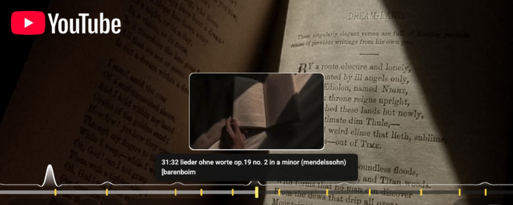

# Highlights for YouTube



A Chrome extension that reads timestamps out of a video's description and top
comments and renders them as clickable highlight markers on the YouTube player.

[](https://chrome.google.com/webstore/detail/highlights-for-youtube/jahmafmcpgdedfjfknmfkhaiejlfdcfc)
[](https://chrome.google.com/webstore/detail/highlights-for-youtube/jahmafmcpgdedfjfknmfkhaiejlfdcfc)

## Features

- **Progress-bar markers** — a tick for every timestamp found, positioned by
  time; hover or focus for the label.
- **Description _and_ comment parsing** — `MM:SS` and `HH:MM:SS`, one line or a
  range (`0:00 - 0:30 Intro`), with URLs and surrounding punctuation stripped.
- **Player controls** — previous / next highlight, the current highlight's label,
  and a show/hide toggle. Also mirrored in the player settings menu.
- **Click to jump** — a marker seeks straight to its timestamp.
- **Setting remembered** across sessions (`chrome.storage`).
- Keyboard accessible, hides during ads, and leaves YouTube's own chapters alone.

## Install

### Chrome Web Store

[Highlights for YouTube](https://chrome.google.com/webstore/detail/highlights-for-youtube/jahmafmcpgdedfjfknmfkhaiejlfdcfc)
→ **Add to Chrome**.

### From source

Requires Node 20+ and Chrome 111+.

```sh
npm ci
npm run build      # writes dist/
```

Then `chrome://extensions` → enable **Developer mode** → **Load unpacked** →
select the `dist/` folder.

## Development

```sh
npm run watch       # rebuild dist/ on change (unminified, sourcemaps)
npm test            # vitest
npm run typecheck   # tsc --noEmit
npm run lint        # eslint
npm run check       # typecheck + lint + format + test + build
```

### Layout

```
src/
  core/        pure, DOM-free, 100% unit-tested — parsing, dedupe, layout, navigation
  shared/      cross-world message bus + async primitives
  page/        MAIN world: the #movie_player API + the full description text
  content/     ISOLATED world: DOM, the overlay UI, and the per-video lifecycle
  styles/      content.css
  manifest.json
scripts/build.mjs   esbuild → dist/{content,page}.js + assets
_locales/           chrome.i18n messages
```

The extension loads two content scripts. `src/page` runs in the page's **main
world** (Chrome 111+ `content_scripts.world`) so it can call the YouTube player
API; `src/content` runs in the **isolated world** and owns everything the
extension draws. They talk over a private `CustomEvent` channel
(`src/shared/protocol.ts`). All the parsing logic is pure and lives in
`src/core`, independent of the DOM.

`package.json` is the single source of truth for the version — `npm run build`
stamps it into `dist/manifest.json`.

## Privacy

All processing is local. The extension only runs on `youtube.com`, stores a
single boolean setting via `chrome.storage.local`, and sends nothing anywhere.

## License

`package.json` declares MIT. Add a `LICENSE` file to make it official.
